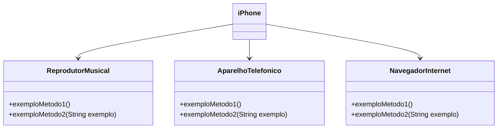

# Iphone System 🍏
This system was made by me, where I implemented the same characteristics as an iPhone in this project!

### Features I modeled
1. **Reprodutor Musical**
   - Métodos: `tocar()`, `pausar()`, `selecionarMusica(String musica)`
2. **Aparelho Telefônico**
   - Métodos: `ligar(String numero)`, `atender()`, `iniciarCorreioVoz()`
3. **Navegador na Internet**
   - Métodos: `exibirPagina(String url)`, `adicionarNovaAba()`, `atualizarPagina()`
  
### UML diagram 📑 :

